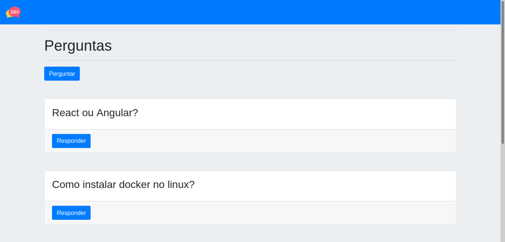

<h1 align="center">Q&A</h1>

<p align="center">
    
</p>

<br>

## 🧪 Tecnologias

Esse projeto foi desenvolvido com as seguintes tecnologias:

- [React](https://reactjs.org)
- [Express](https://expressjs.com/)
- [Sequelize](https://sequelize.org/)
- [Mysql2](https://www.npmjs.com/package/mysql2)
- [Bootstrap](https://getbootstrap.com/)

## 🚀 Como executar

Clone o projeto e acesse a pasta do mesmo.

```bash
$ git clone https://github.com/morricedev/q-a
$ cd q-a
```

Para iniciá-lo, siga os passos abaixo:

```bash
# Instalar as dependências
$ yarn

# Copie o arquivo .env.example, renomeie para .env e então configure suas variáveis de ambiente
$ cp .env.example .env

# Iniciar o projeto
$ yarn start
```

O app estará disponível no seu browser pelo endereço http://localhost:8080.

## 💻 Projeto

O projeto é um site para responder e perguntar anonimamente.

---

Feito com 💜 by Morrice 👋🏻
